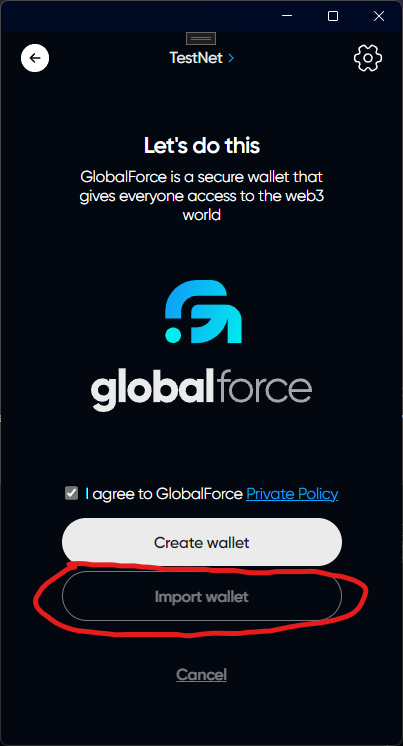
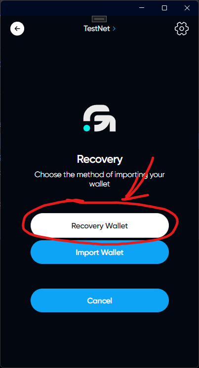
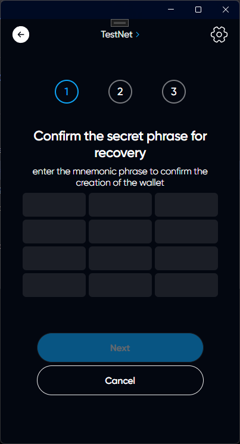
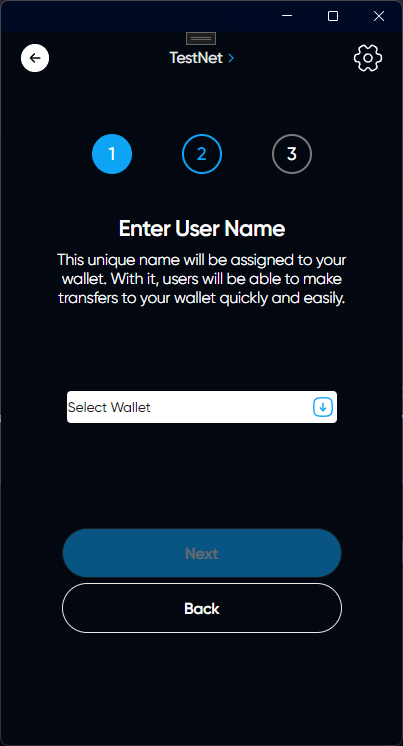
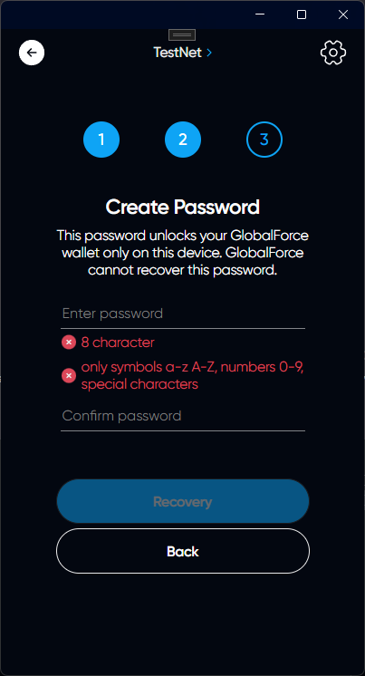
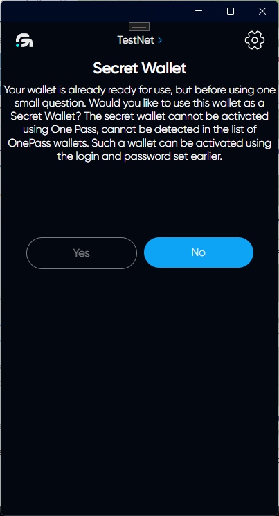
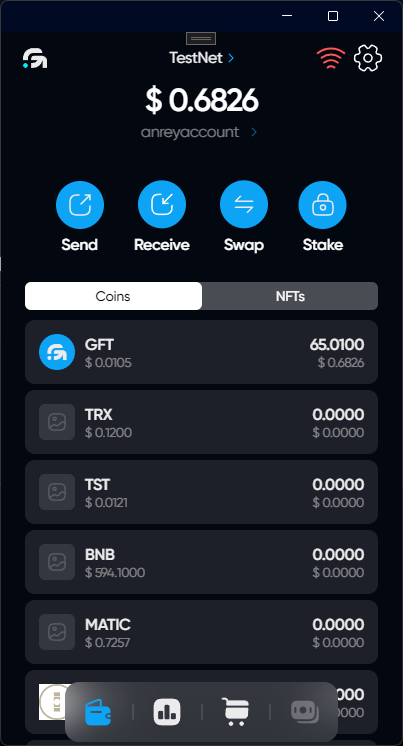

# Account recovery by seed phrase
## If you already have an account in the app and you want to recovery another one

Click on your account name on the main page. You will see the OnePass menu for a quick account change. At the bottom of this menu, click on "Add wallet | Login"

## Here is the authorization page
### Click on "Import wallet"

### Select "Recovery Wallet"

### Enter your seed phrase

### Select account

### Creating password

Please come up with a strong password and remember it, then enter it again.



Remember, GlobalForce cannot recover any data stored in the application, as it is securely encrypted



### Secret Wallet

Your wallet is already ready for use, but before using one small question. Would you like to use this wallet as a Secret Wallet? The secret wallet cannot be activated using One Pass, cannot be detected in the list of OnePass wallets. Such a wallet can be activated using the login and password set earlier.

# Congratulations, the account has been recovered!

