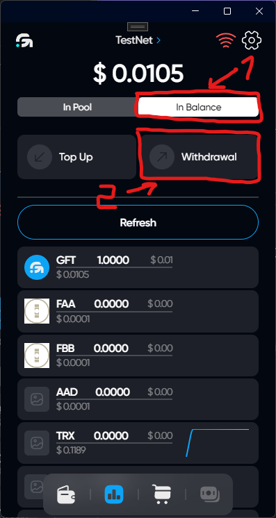
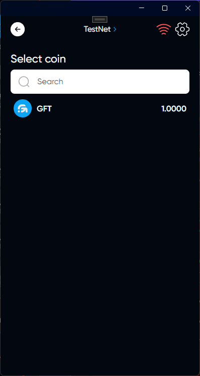
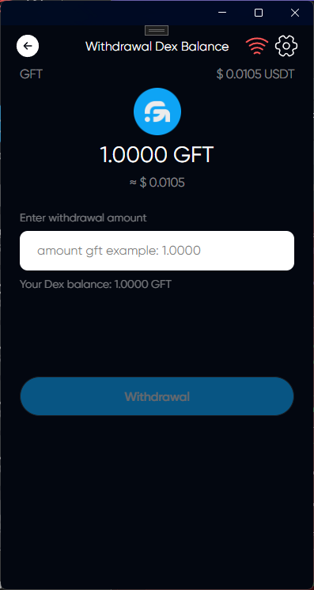

# Balance Withdrawal

## Description

DEX balance is used to replenish and withdraw from the pool of funds

## How Withdrawal balance

### Click on DEX icon

### Select tab In Balance & click on Withdrawal

### Choose a token that you want to Withdrawal from DEX

### Enter the amount of withdrawal



When you withdraw your DEX balance, tokens will be debited from your DEX balance and then appear on your wallet balance



### Click on Withdrawal

### You have successfully withdrawaled your balance in DEX