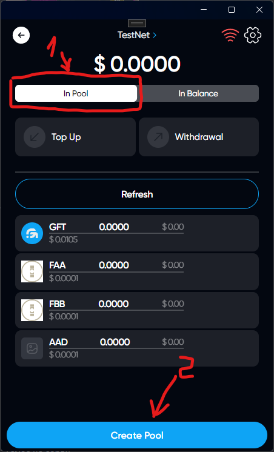
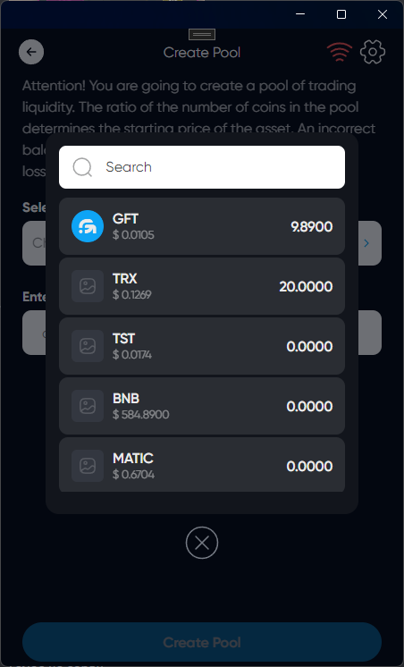
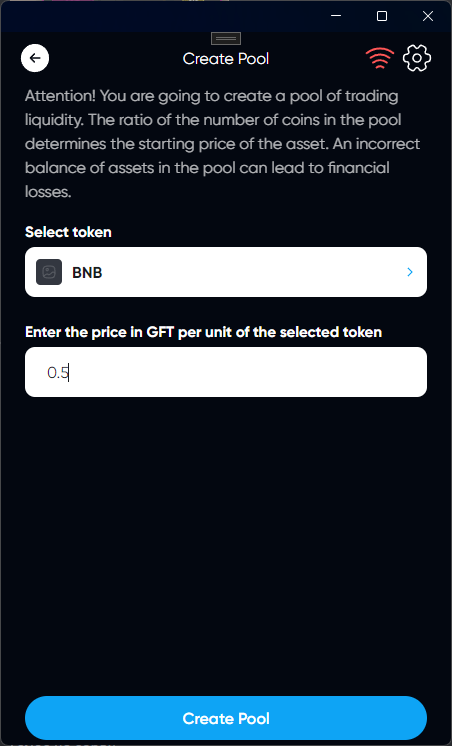

# Create Pool

## Description

You can create a pool to the pool if this pool is no longer created

## How Create Pool

### Click on DEX icon

### Select tab In Pool

### Choose a token for which you want to create a pool

### Enter the price in GFT per unit of the selected token



After creating, the pool will need to be replenished with liquidity

[Pool Top Up](./pool-top-up.md)



### Click on Create Pool

### You have successfully created a pool in DEX
