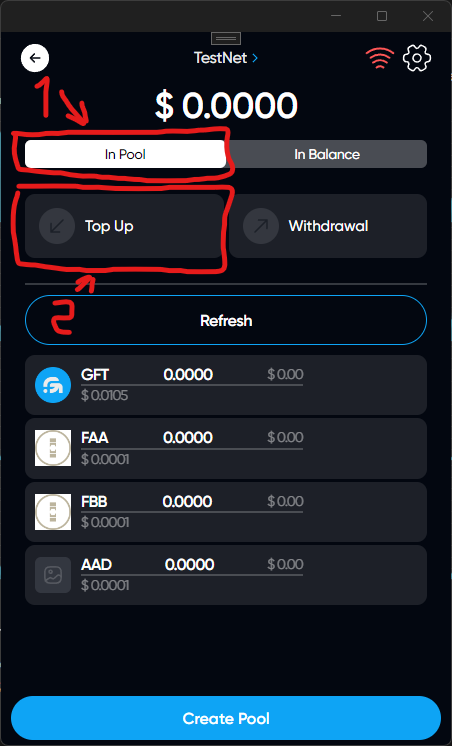
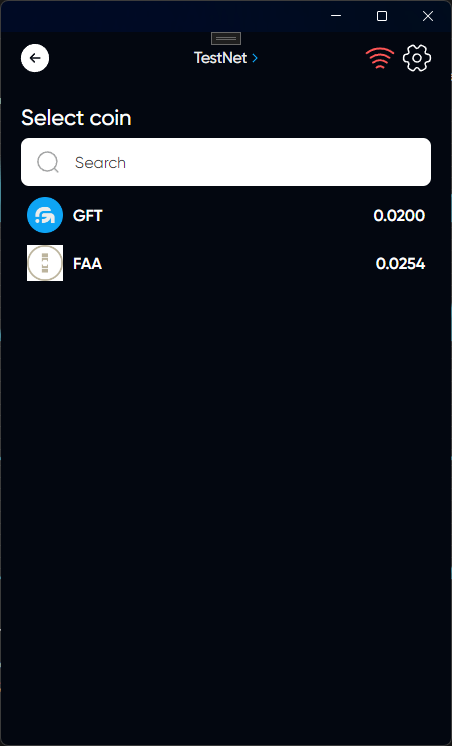
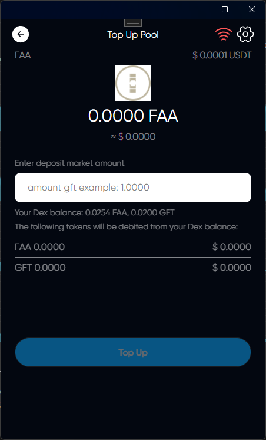
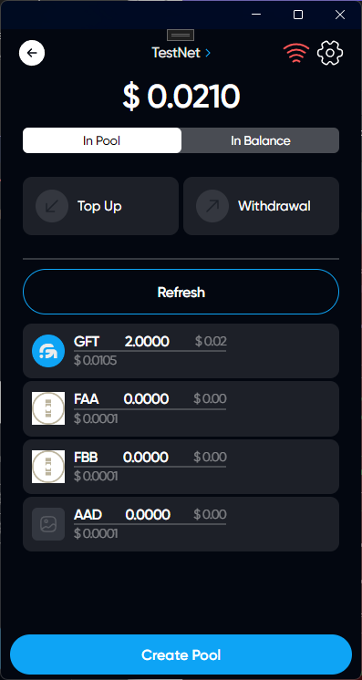

# Pool Top Up

## Description

The Dex pool is used to exchange coins. You bring great benefits by replenishing the pool, as well as get rewarded for it

## How Top Up Pool

### Click on DEX icon

### Select tab In Pool & click on Top Up

### Choose a token that you want to replenish in DEX pool

### Enter the amount of replenishment



When replenishing the DEX pool, tokens will be debited from your DEX balance and then credited to the DEX pool. Keep in mind that the pool is replenished with 2 tokens, the network token and the token that you have selected. After entering the amount, the amount of tokens that will be debited from the balance will be displayed



### Click on Top Up

### You have successfully replenished Pool in DEX

