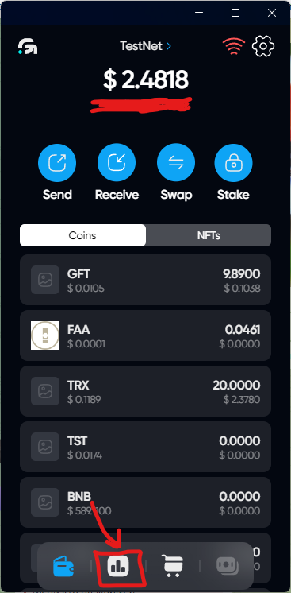
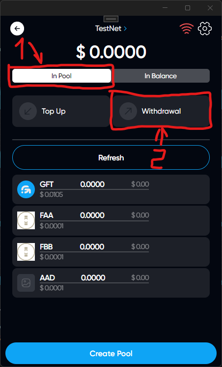
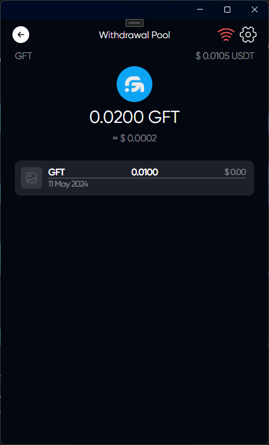
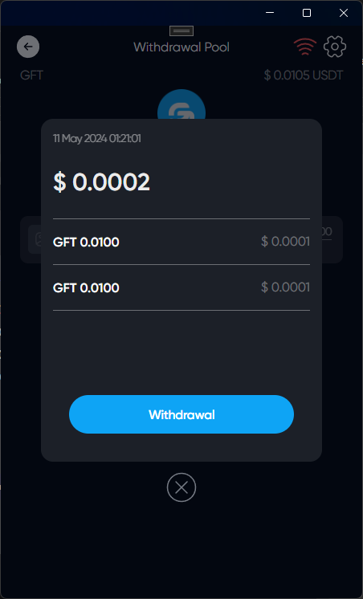
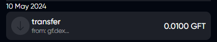
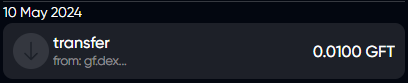

# Pool Withdrawal

## Description

You can remove your funds from the pool immediately to your wallet

## How Withdrawal Pool

### Click on DEX icon

### Select tab In Pool & click on Withdrawal

### Choose a token that you want to Withdrawal in DEX pool

### Choose a contribution that you want to return to your wallet



When withdrawing funds from the DEX pool, the funds will be returned to your wallet, not to the DEX balance. You will get 2 tokens back, the first is the network token, the second is the pool token that you replenished earlier



### Click on Withdrawal

### You have successfully withdrawal the funds from the dex pool

