# Create NFT



Before creating an NFT, make sure that you already have a prepared collection id. Read how [Create Collection NFT](./create-collection-nft.md)



## How Create asset for NFT



At the moment, asset can be created via Wallet Connect. This is a special protocol with which you can create a connection between a wallet and a decentralized application



### Open one of the websites below given the network you need

[Create Asset in MainNet](https://globalforce.io/account/gf.asset/)

[Create Asset in TestNet](https://dev.globalforce.io/account/gf.asset/)

### Click on the wallet connection button

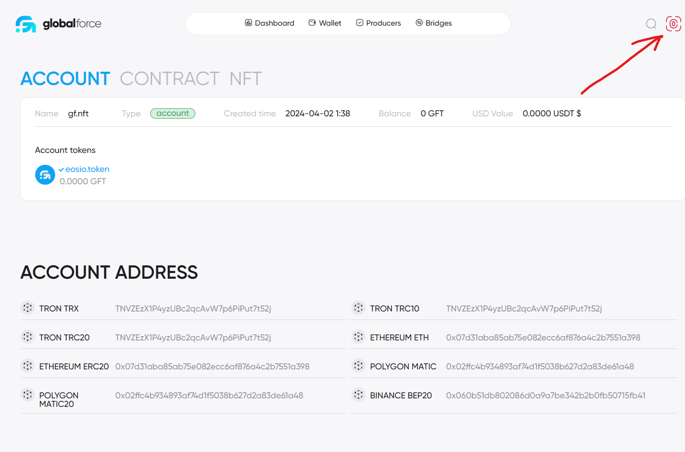

Scan the QR code from your smartphone if you have opened the website on your computer or click the Open App button if the application is installed on your device

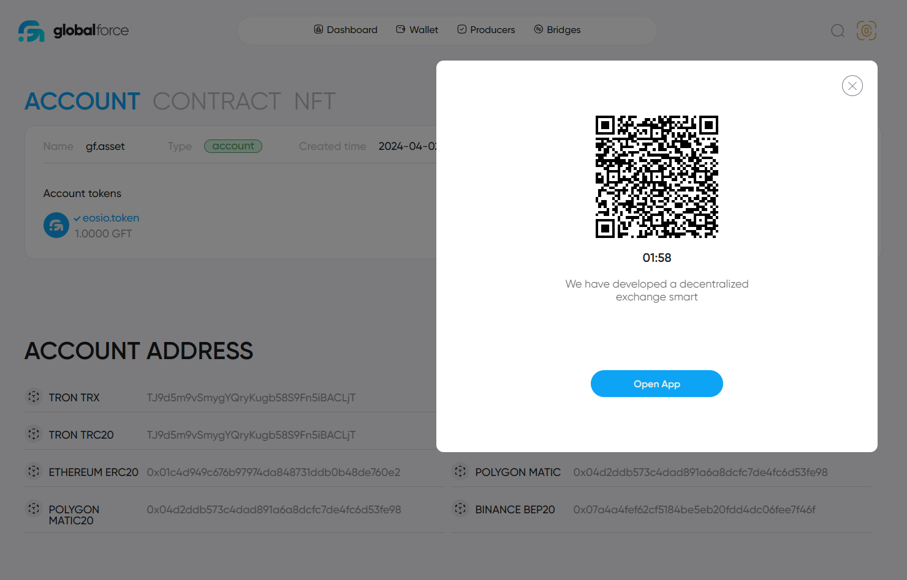

### Select the CONTRACT tab

### Select the Actions tab

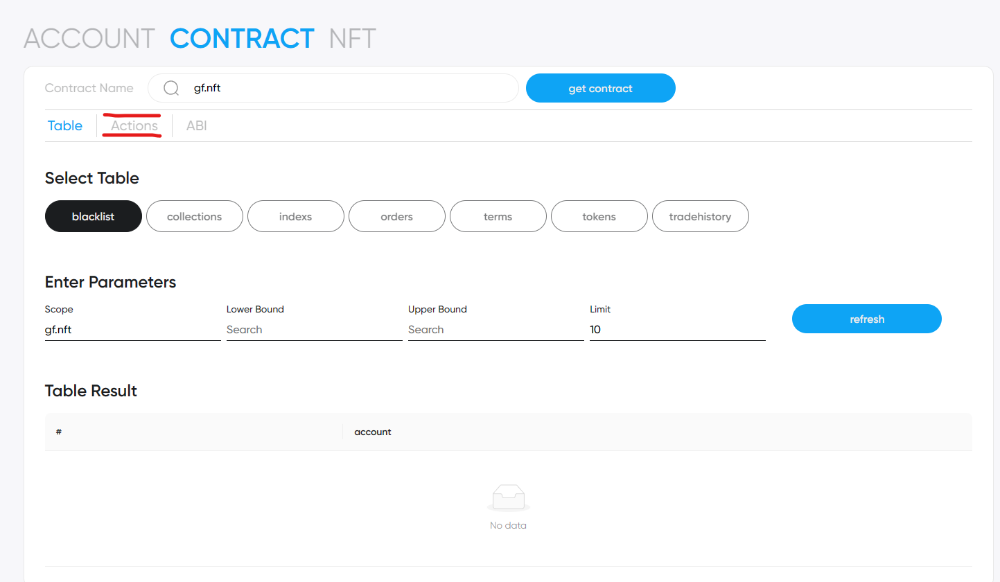

### Select the store action

### Fill in the following fields

issuer - your username
owner - your username
base54 - PNG Image in Base64 encoding

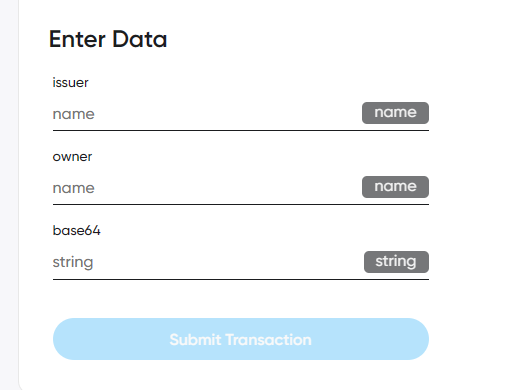

### After filling in the fields, click Submit transaction

### Confirm the transaction in the application

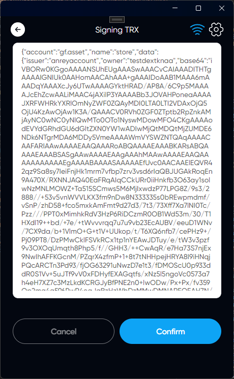

### After successful completion, click on the search icon, enter your username

### Find your transaction in the action history and click on the transaction id

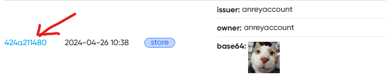

### Expand the "created" action data field

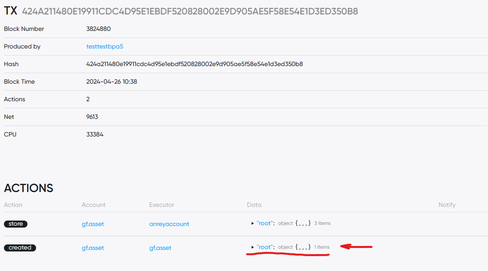

### Save this id

### Now your Asset is ready and you can use it to publish your nft

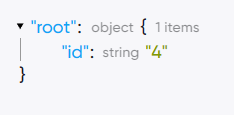

## How To Publish NFT



At the moment, NFT can be publish via Wallet Connect. This is a special protocol with which you can create a connection between a wallet and a decentralized application



### Open one of the websites below given the network you need

[Create NFT in MainNet](https://globalforce.io/account/gf.nft/)

[Create NFT in TestNet](https://dev.globalforce.io/account/gf.nft/)

### Click on the wallet connection button

Scan the QR code from your smartphone if you have opened the website on your computer or click the Open App button if the application is installed on your device

### Select the CONTRACT tab

### Select the Actions tab

### Select the issuenft action

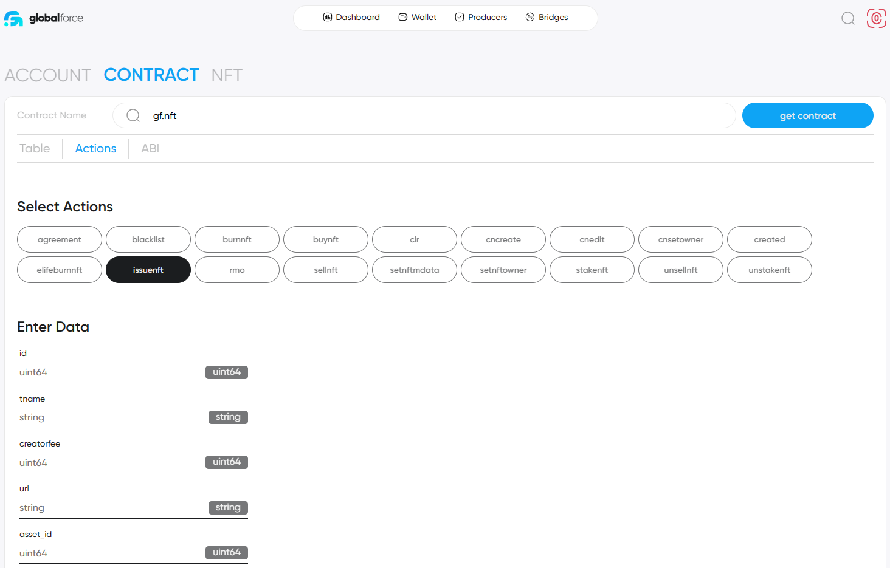

### Fill in the following fields

**id** - collection id. Read how [Create Collection NFT](./create-collection-nft.md)

**tname** - name of NFT

**creatorfee** - How many percent of the purchase of NFT will be listed to you as the Creator (0-100)

**url** - The address of your site (https://example.com)

**asset_id** - ID of the Asset you created. [Create Asset for NFT](#how-create-asset-for-nft)

**freezetime** - Unix Time (UTC) when your token is defrosted. Use the online converter to get this value. For example [unixtime.org](https://unixtime.org/). If it is 0, then this token will not be frozen

**lifetime** - Unix Time (UTC) when your token is defrosted. Use the online converter to get this value. For example [unixtime.org](https://unixtime.org/). If 0, then this token will live forever

**immutable** - UNSONED Data, json

**mutables** - Updated data, json - can be changed by action setnftmdata

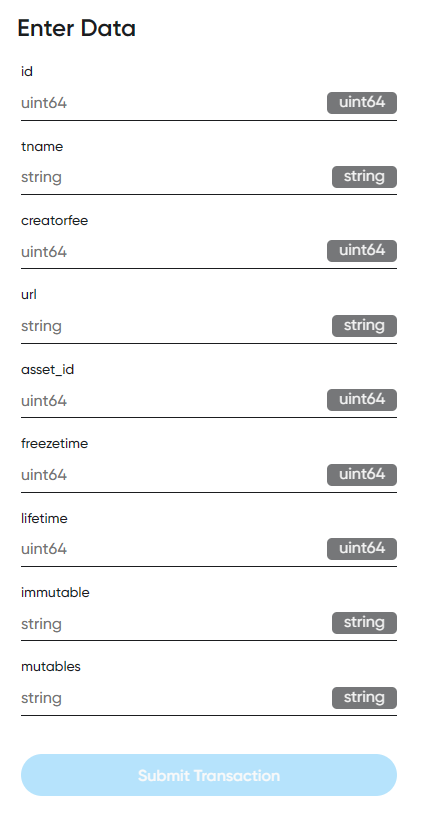

### After filling in the fields, click Submit transaction

### Confirm the transaction in the application

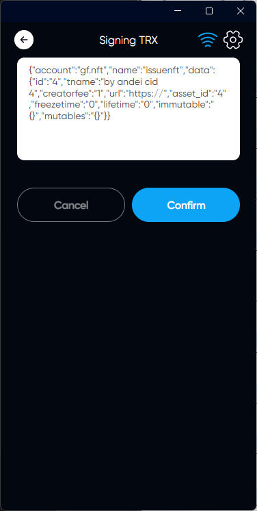

### After successful completion, click on the search icon, enter your username

### Find your transaction in the action history and click on the transaction id

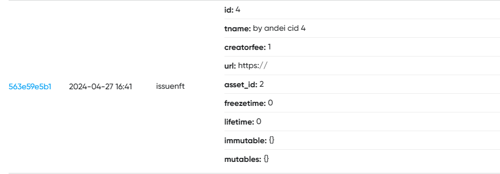

### Expand the "created" action data field

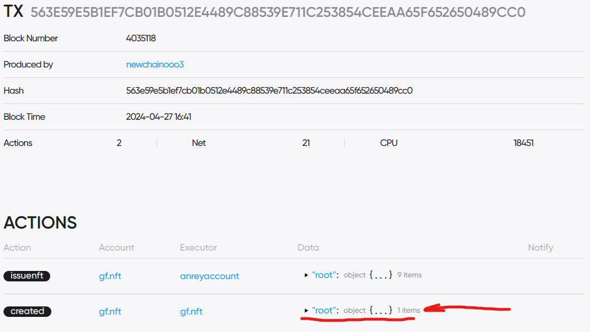

### Save this id

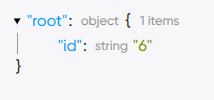

## Now your NFT Ready & you can see it in App

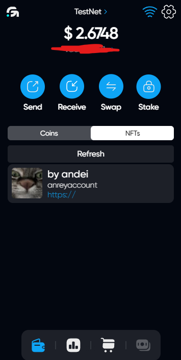

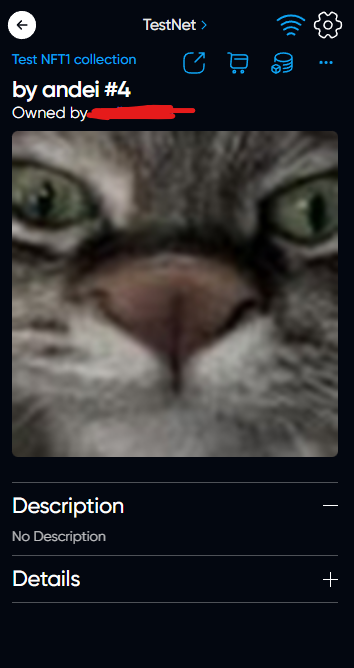