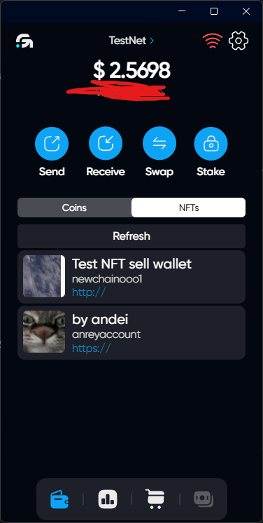
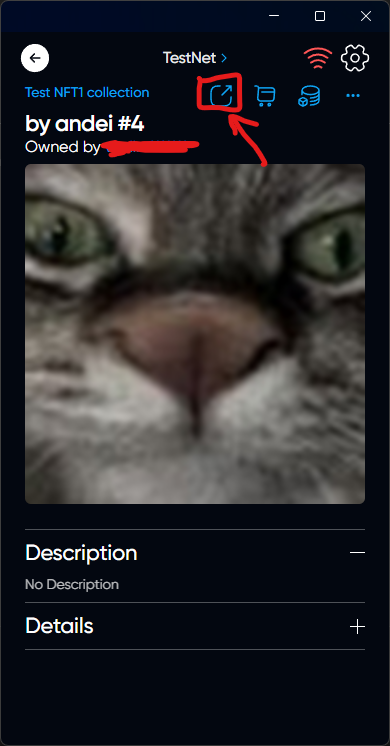
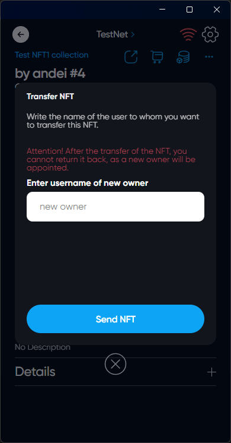

# Send NFT

## Description



You can transfer NFT to any other user



## How Send NFT

### Choose the right NFT on the NFTs tab in the main menu

### Click on the sending icon

### Write the name of the user to whom you want to transfer this NFT



Attention! After the transfer of the NFT, you cannot return it back, as a new owner will be appointed.



### Click on Send NFT

### You handed over NFT!