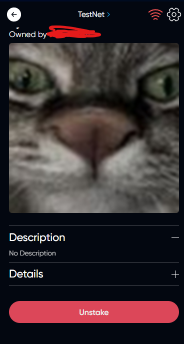

# Stake NFT

## Description



If this NFT was created by the project working on the block Globalforce.For example, a game.
And if the developer provides for the possibility of awarding for Stake or this is required to work his project, you can Stake NFT



## How Stake NFT

### Choose the right NFT on the NFTs tab in the main menu

### Click on the Stake icon

### Choose the date to which your NFT will be frozen



After stake NFT, you will be able to receive a reward if it is implied in the Dapp you use.





After time you can Unstake, your nft



