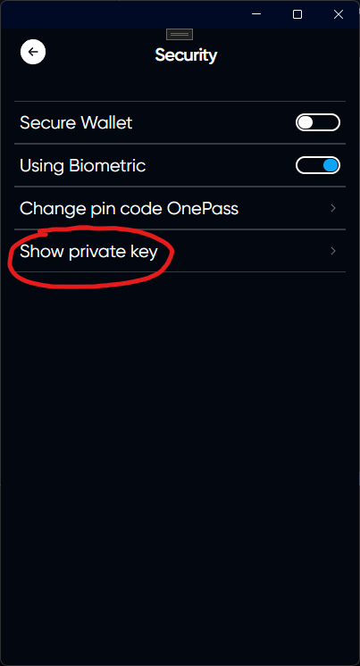

# Getting private key

## Log in to your account and open the settings

## Open the security tab

## Click on Show private key

## Enter password from your current account



ATTENTION. This is your private wallet key. Do not transfer it to third parties.

