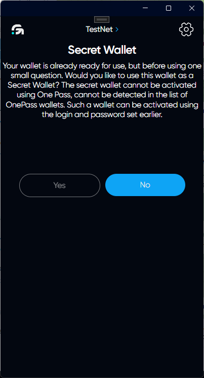
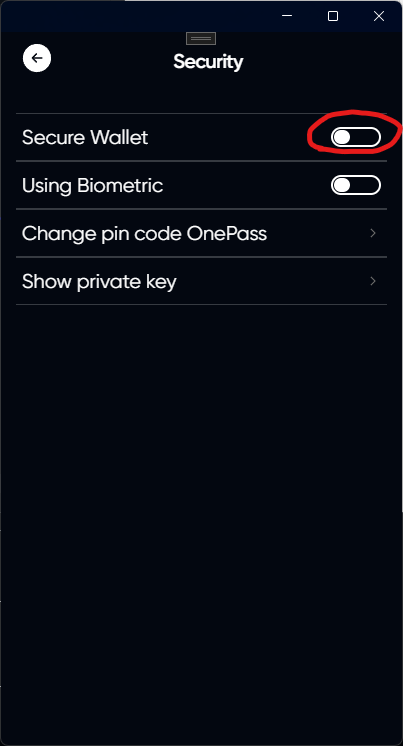
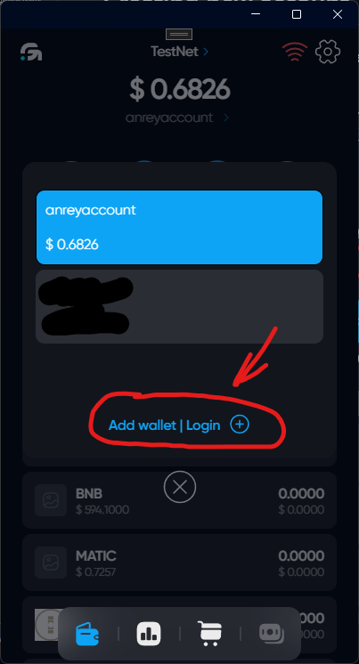
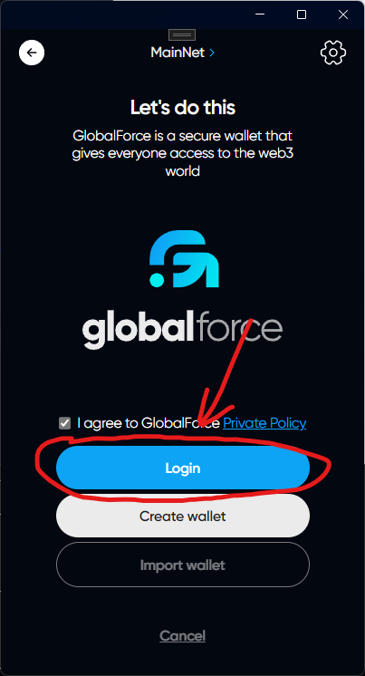
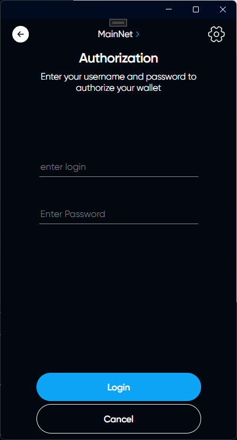

# Secure wallet (Secret Wallet)

## Description

Secure wallet is a special mode of your account in which it is not available in the OnePass system. This mode significantly increases the security of your data, but reduces your usability.

## Secure Wallet activation

### 1. When creating a new account

If you want to activate this mode when creating a new account, click "YES"

### 2. For an existing account

Click on the settings icon in the upper right corner of the application

Open the security tab

Enable the Secure wallet feature

## Logging into a wallet with the Secure wallet mod enabled

### If you have an OnePass account

Click on your account name on the main page. You will see the OnePass menu for a quick account change. At the bottom of this menu, click on "Add wallet | Login"

### Authorization

Click on the "Login" button

Enter your username and password for this account

# Congratulations, you have successfully logged into your account

