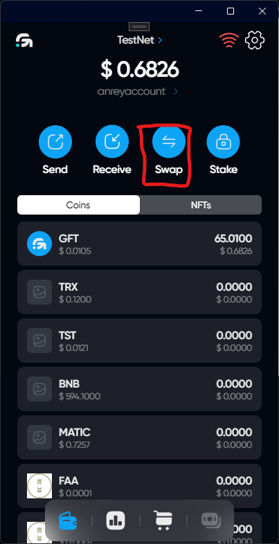
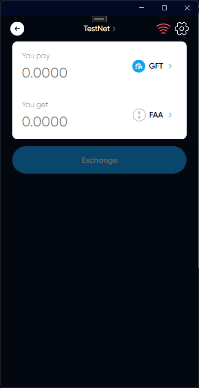

# Swap tokens

## Description

You can exchange your tokens for others. A decentralized DEX exchange is used, so the list of available tokens for exchange is formed from the list of pools in DEX

## Swap

### Click on the Swap button to go to menu Swap 

### Choose a token for which you want to exchange

After that, click exchange



Please note that you cannot exchange more than 1% of the pool at a time



