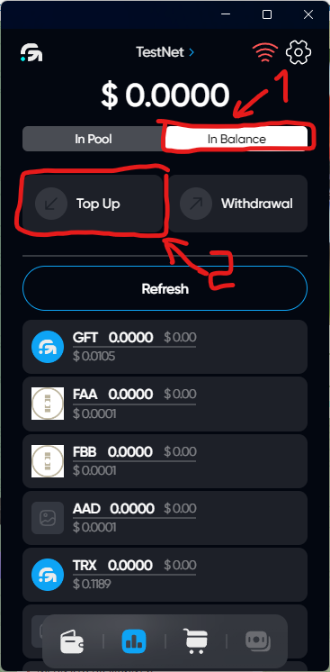
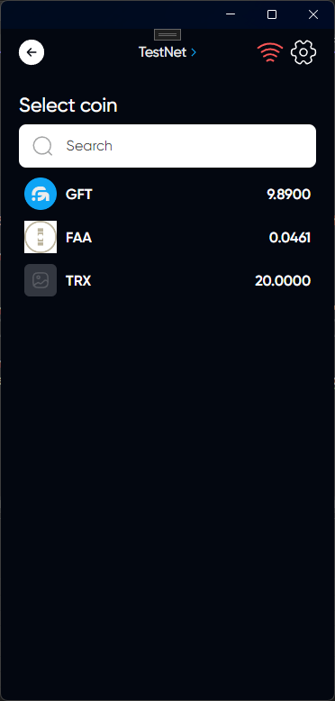
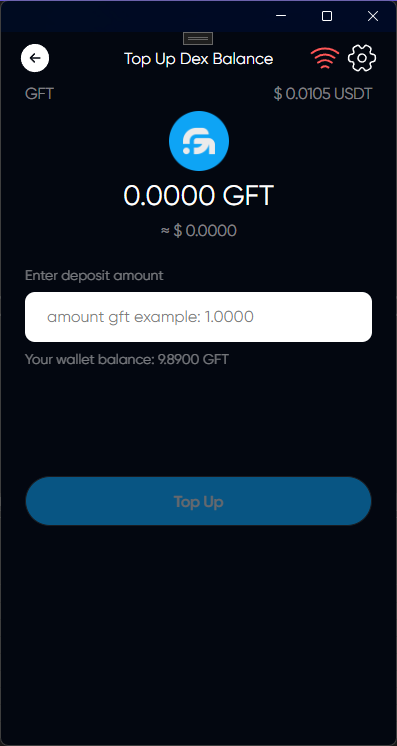
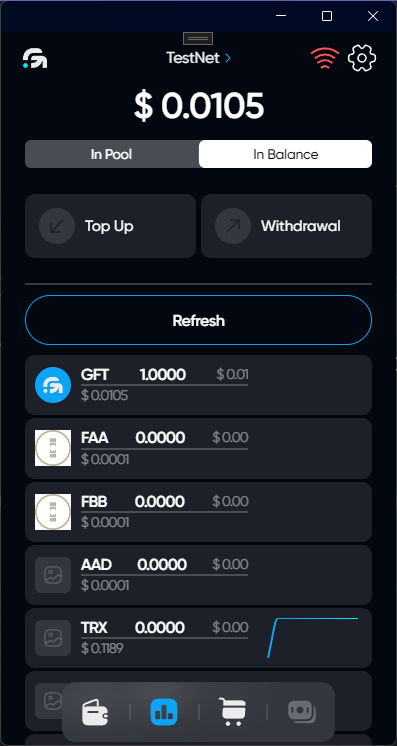

# Balance Top Up

## Description

DEX balance is used to replenish and withdraw from the pool of funds

## How Top Up balance

### Click on DEX icon

### Select tab In Balance & click on Top Up

### Choose a token that you want to replenish in DEX

### Enter the amount of replenishment



When replenishing the DEX balance, the tokens will be debited from your wallet and then appear on the DEX balance



### Click on Top Up

### You have successfully replenished your balance in DEX

