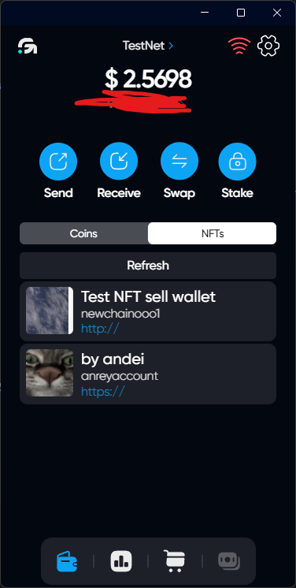
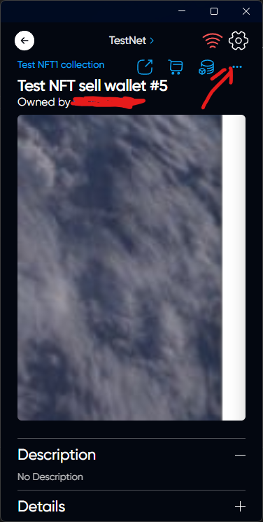
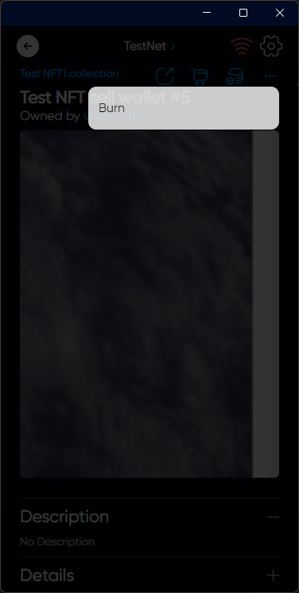
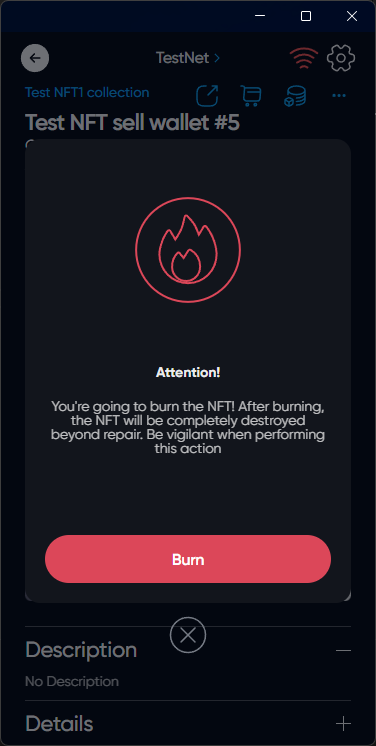

# Burn NFT



This action is not reversible, burning NFT, it is completely removed from the blockchain!



## How Burn NFT

### Choose the right NFT on the NFTs tab in the main menu

### Click on 3 dots in the right upper needle of the screen

### Click on Burn

### Click on Burn



You're going to burn the NFT! After burning, the NFT will be completely destroyed beyond repair. Be vigilant when performing this action



