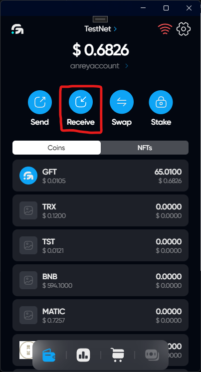
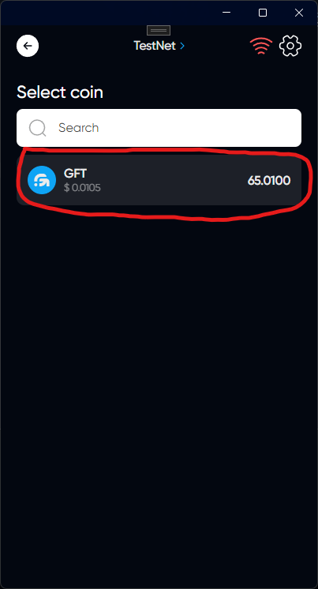
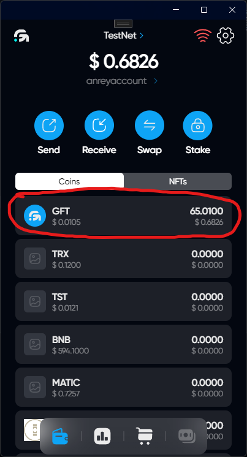
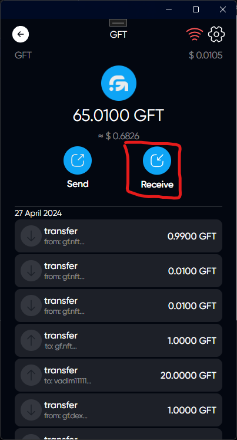
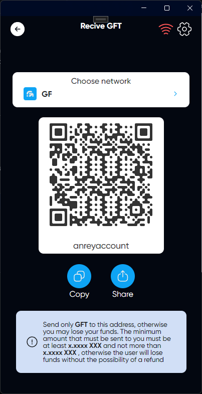

# Receiving tokens

## How to get to the token receive page

### 1. Via the receive button on the main page

Click on the Receive button to go to the menu to select the token you want to send

Select the token you want to send to go to the token receive page

### 2. Through the displayed list of tokens

Click on the token you want to receive

Click on the Receive button to go to the token receive page

## Token receiving page

### Network

If the token supports only one network, it will be selected automatically. If the token supports many networks, select the one you need by clicking on Choose network

### Copy

When you click on Copy, the address of your wallet will be copied to the clipboard

### Share
By clicking on share, you will be able to send your wallet address immediately to the application you need.

