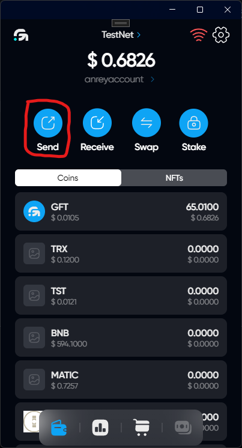
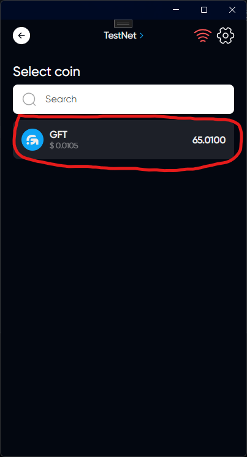
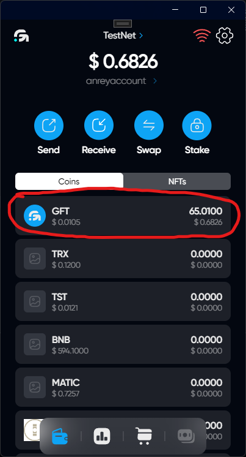
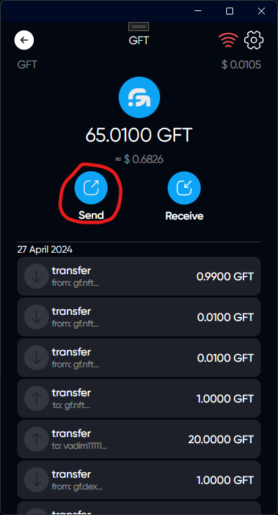
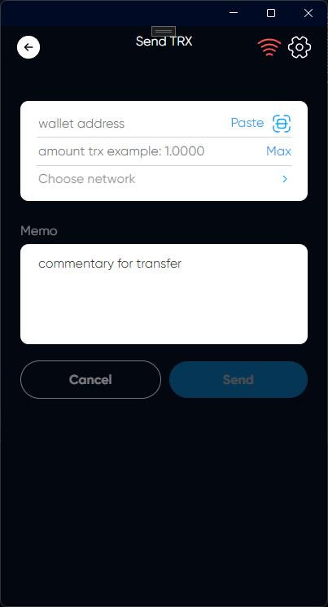

# Sending tokens

## How to get to the token sending page

### 1. Via the Send button on the main page

Click on the Send button to go to the menu to select the token you want to send

Select the token you want to send to go to the token sending page

### 2. Through the displayed list of tokens

Click on the token you want to send

Click on the Send button to go to the token sending page

## Token sending page

### User Name input field

You can enter the username manually, paste the copied username, or scan the QR code

### The amount of tokens to send

You can enter the amount manually or by clicking on the Max button set the maximum value that is equal to your balance

### Network

If the token supports only one network, it will be selected automatically. If the token supports many networks, select the one you need by clicking on Choose network

### Memo

If you are sending funds to a regular user, you can use this field to write a comment on the payment

Some contracts (users) can use this field to verify payment with subsequent execution of actions within this contract. An incorrectly written memo for such contracts may serve as a refusal to send funds

