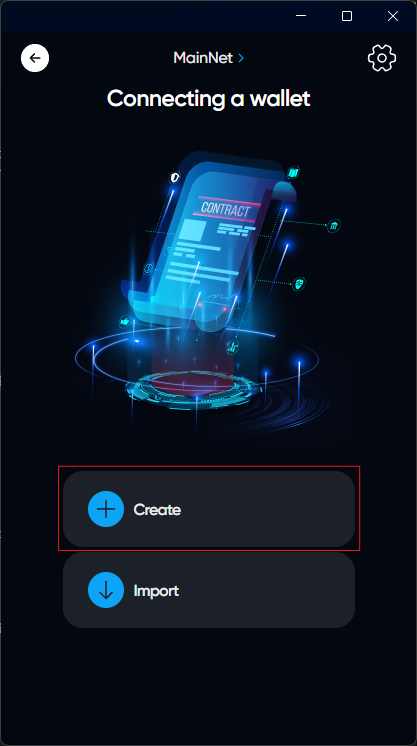
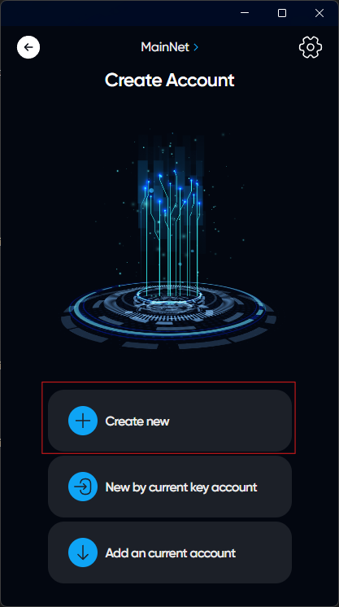
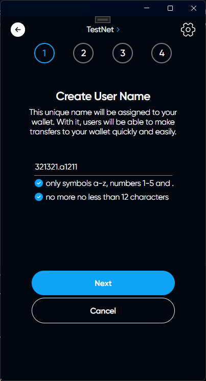
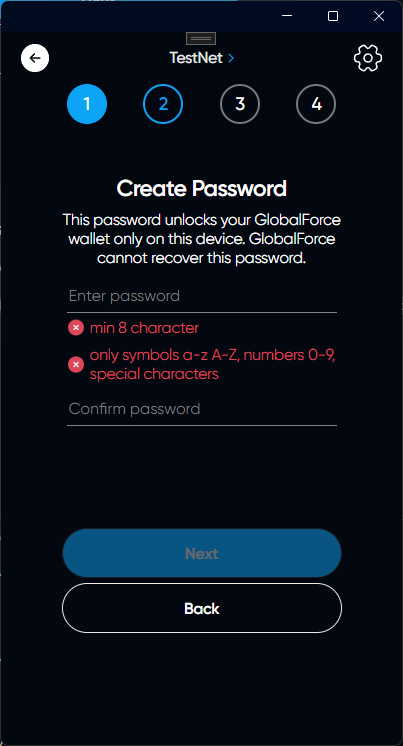
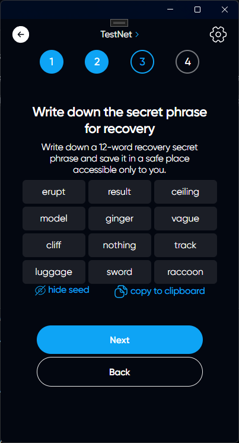
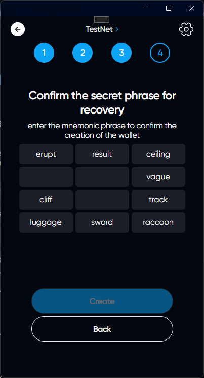
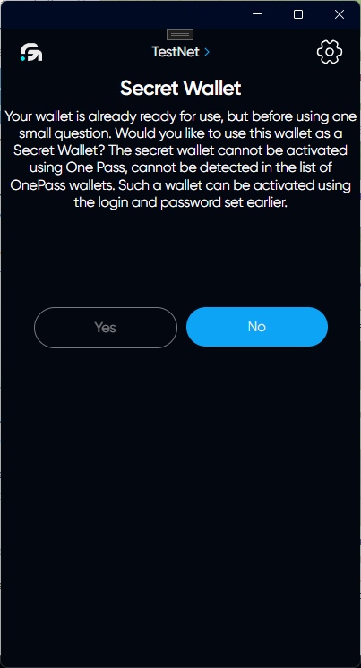
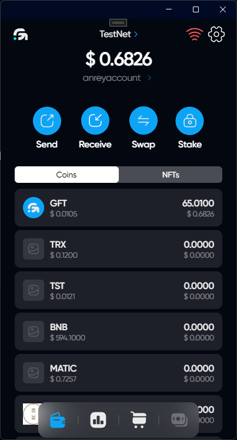

# Creating new account

## If you already have an account in the app and you want to add another one

Click on your account name on the main page. You will see the OnePass menu for a quick account change. At the bottom of this menu, click on "Add wallet | Login"

## Here is the authorization page

Click on "Create"

Select "Create new"

### Creating username

Enter exactly 12 characters in the input field using the allowed characters. After entering, the application will check if such an account already exists and if such an account does not exist and you entered the new username correctly, the "next" button will be unlocked

### Creating password

Please come up with a strong password and remember it, then enter it again.



Remember, GlobalForce cannot recover any data stored in the application, as it is securely encrypted



### Write down secret phrase on paper

Write down this phrase on paper and keep this sheet in a safe place. With this phrase, you can restore your wallet in case of loss of the device



Remember, GlobalForce cannot recover any data stored in the application, as it is securely encrypted



### Confirm the secret phrase for recovery

Confirm the last phrase by entering the words that you have saved

### Secret Wallet

Your wallet is already ready for use, but before using one small question. Would you like to use this wallet as a Secret Wallet? The secret wallet cannot be activated using One Pass, cannot be detected in the list of OnePass wallets. Such a wallet can be activated using the login and password set earlier.

# Congratulations, the account has been created

