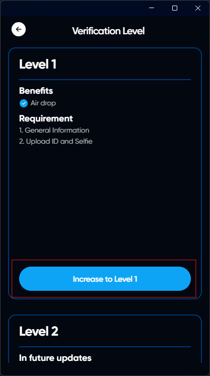

# KYC



To pass KYC, you need to have an account in the application



## Open the settings

## Click on Verification Level

## Select Level and click Increase to Level

## Follow the instructions of the provider KYC