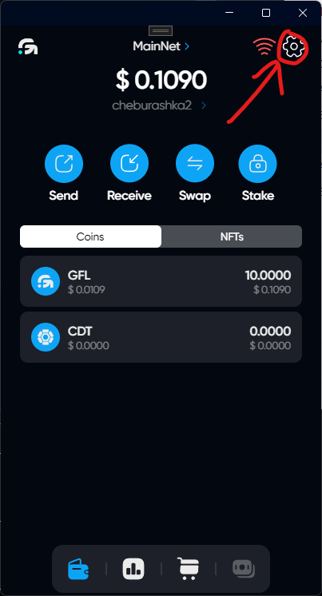
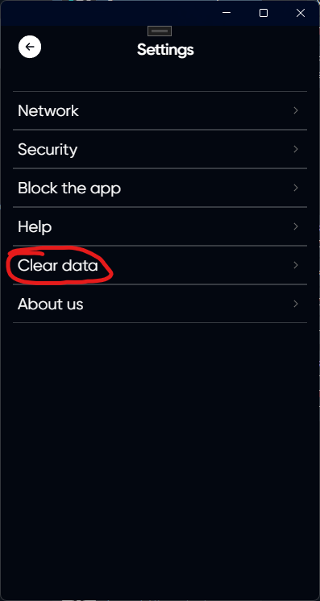
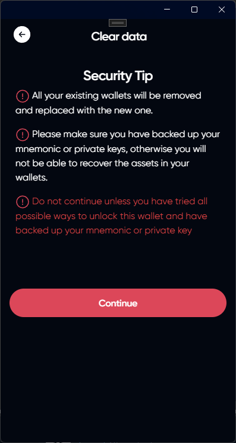

# Reset Data

## Open the settings

## Click on Clear data



All your existing wallets will be removed and replaced with the new one.





Please make sure you have backed up your mnemonic or private keys, otherwise you will not be able to recover the assets in your wallets.





Do not continue unless you have tried all possible ways to unlock this wallet and have backed up your mnemonic or private key



