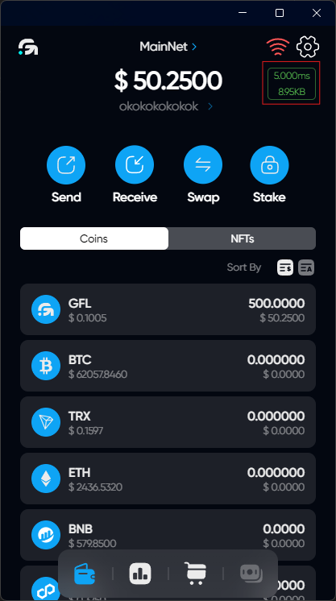
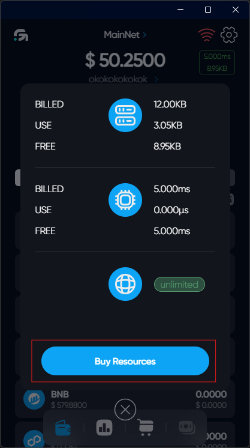
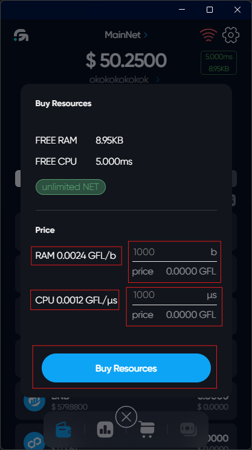

# Resources



The transactions that you make using your wallet require resources such as processor time and RAM. In order to execute transactions, you need to monitor the level of available resources and renew them for GFL tokens.



## Click on the widget of resources on the main screen

## Click on Buy Resources

## Enter the number of RAM and CPU resources desired for buying

## Buy resources