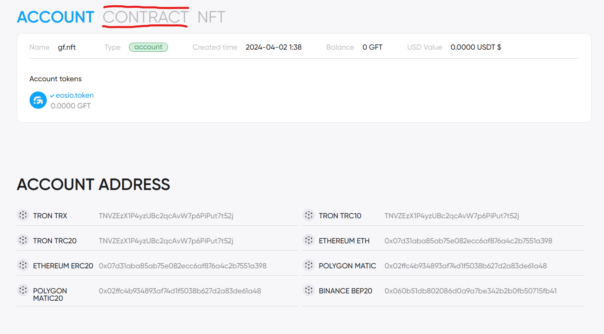
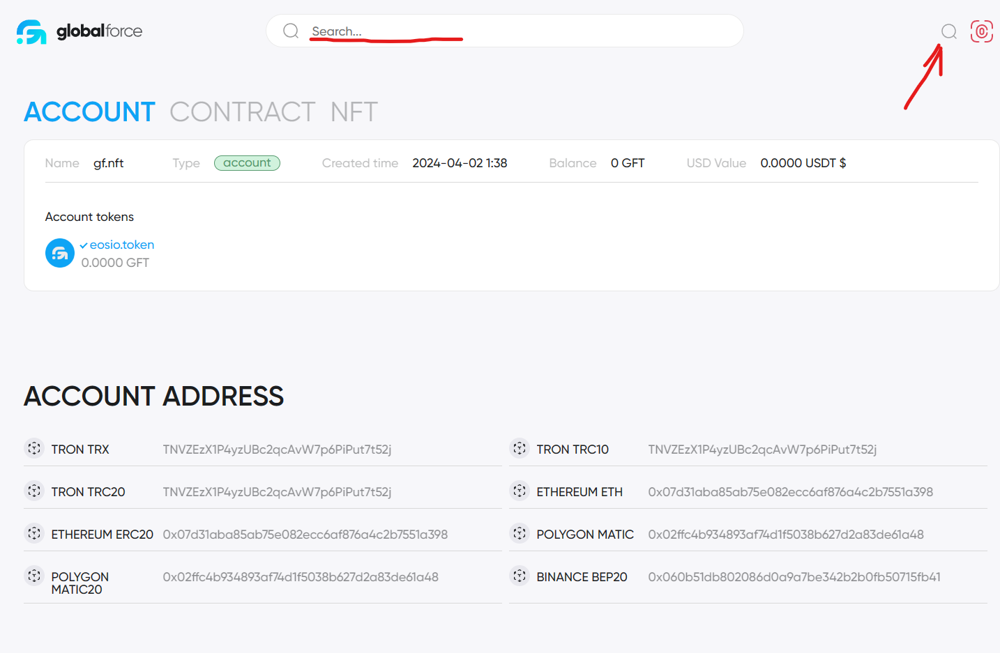

# Collection nft

## Description

All NFTs must be in collections, so before you place an NFT, make sure that you have created a collection or select an existing collection id in which other users are allowed to add NFTs

## How create collection

At the moment, the collection can be created via Wallet Connect. This is a special protocol with which you can create a connection between a wallet and a decentralized application

### Open one of the websites below given the network you need

[Create Collection NFT in MainNet](https://globalforce.io/account/gf.nft/)

[Create Collection NFT in TestNet](https://dev.globalforce.io/account/gf.nft/)

### Click on the wallet connection button

Scan the QR code from your smartphone if you have opened the website on your computer or click the Open App button if the application is installed on your device

### Select the CONTRACT tab

### Select the Actions tab

### Select the cncreate action

### Fill in the following fields

cname - name of the collection
anybody - 1 anyone can create tokens in the collection, 0 - only the creator
owner - your username
desc - description of the collection

### After filling in the fields, click Submit transaction

### Confirm the transaction in the application

### After successful completion, click on the search icon, enter your username

### Find your transaction in the action history and click on the transaction id

### Expand the "created" action data field

### Save this id

## Now your collection is ready and you can use it to place your nfts

