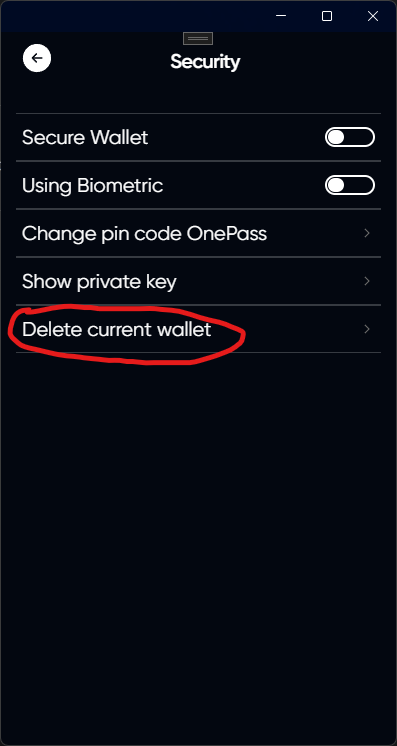

# Delete wallet

## Log in to your account and open the settings

## Open the security tab

## Click on Delete current wallet



Your current wallet "vadim1111111" will be removed.





Please make sure you have backed up your mnemonic or private key, otherwise you will not be able to recover the assets in your wallet.





Do not continue unless you have backed up your mnemonic or private key



