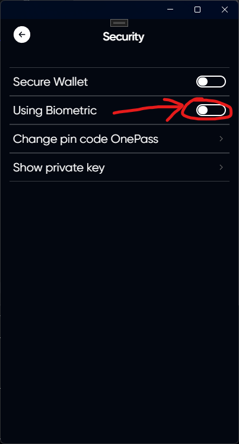
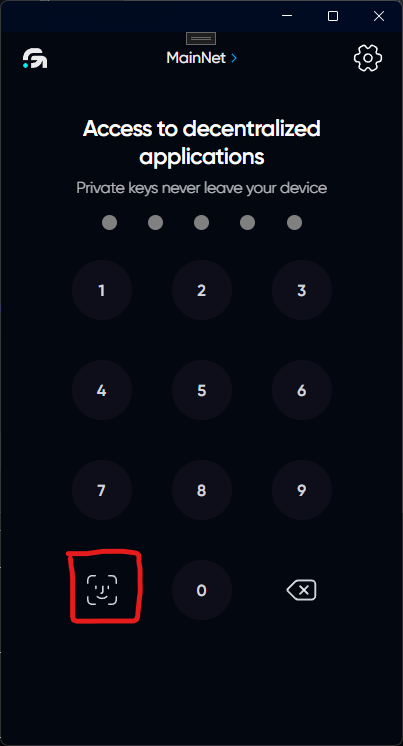

# Using Biometric 

## Description

Using biometrics in no way improves your security if an attacker has gained direct access to your device. When you turn on this feature, you should be aware that the first line of defense (OnePass) is weakening.



We recommend enabling the use of biometrics with Wallet Secure feature



## Enabling the use of biometrics

Click on the settings icon in the upper right corner of the application

Open the security tab

Enable this feature and confirm its use using your biometrics (finger, face, or USB key "if supported by your device and operating system")

## Authorization

Now when you open the app you will be able to use your biometrics instead of the pin code from OnePass

