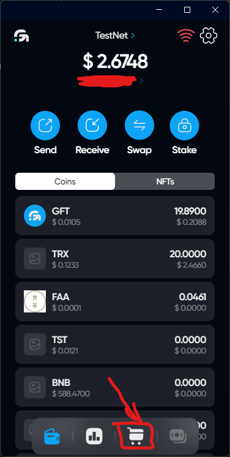
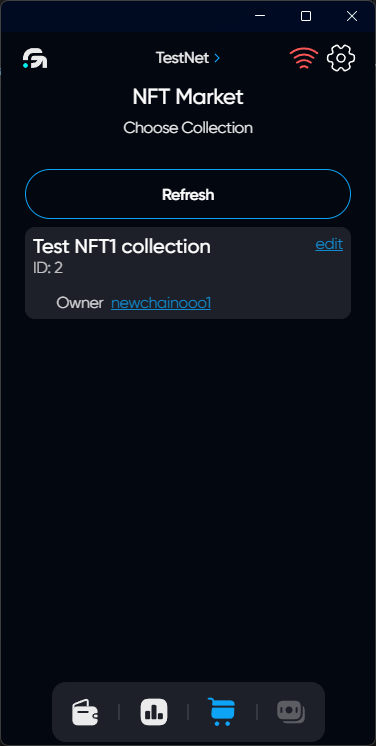
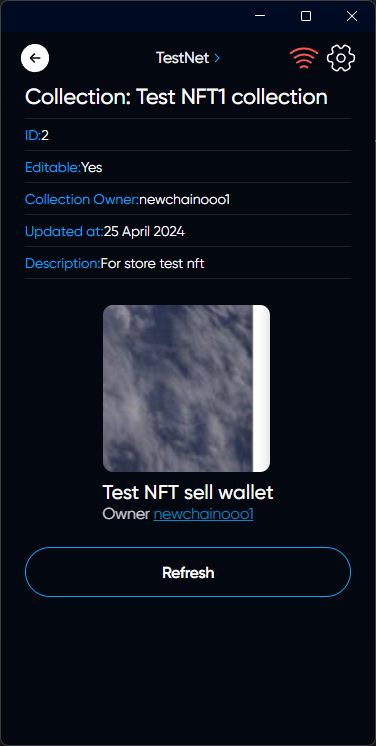
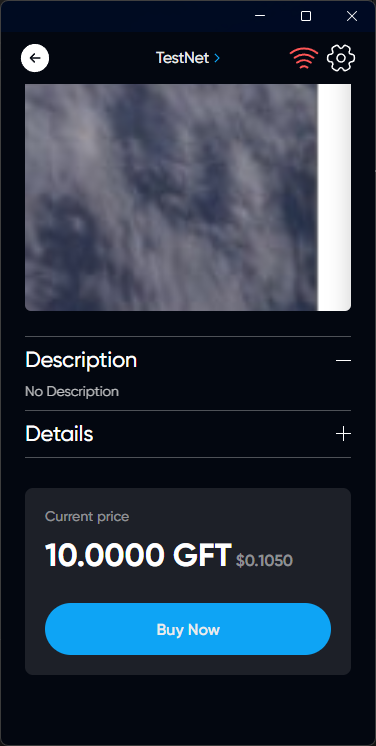
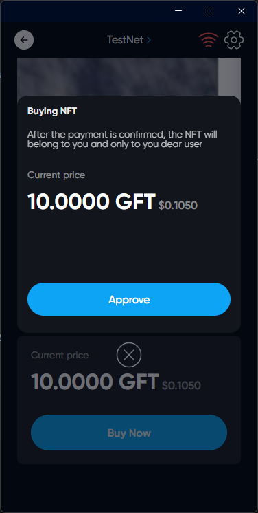

# Buy NFT

## Description



We can get NFT on the market. Consider sellers can receive payments in different tokens



## How to buy NFT

### In the main menu, click on the Shopping Cart icon to open the NFT market

### Choose a collection of interest to you from the list

### Choose you like NFT

### Click Buy NFT button

### Confirm the payment



After the payment is confirmed, the NFT will belong to you and only to you dear user



### Now this is your NFT and you can see it on the NFTs in the main menu

