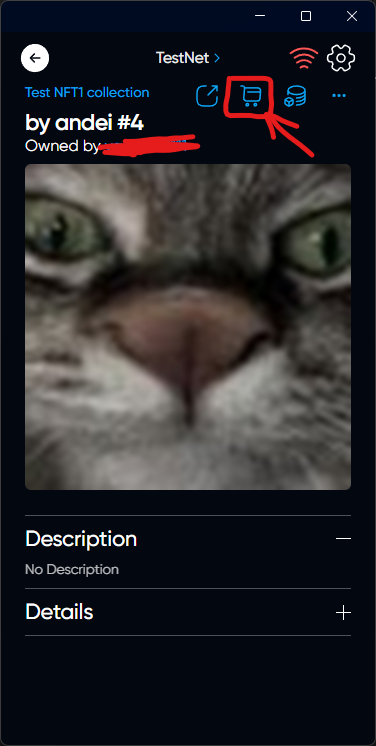
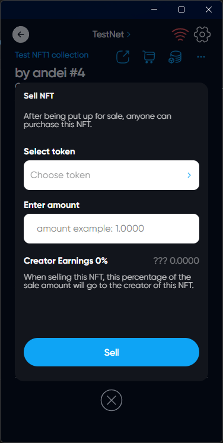
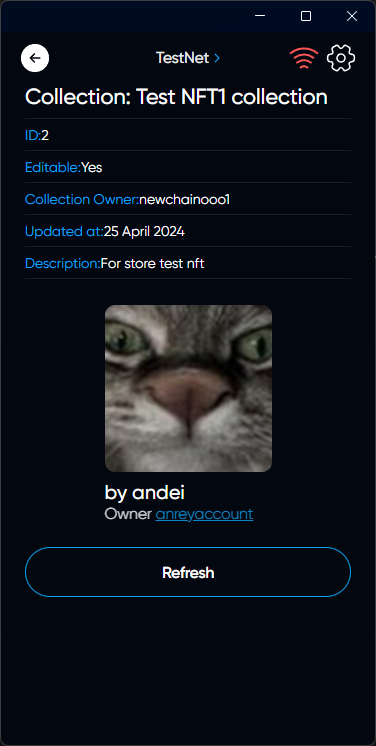
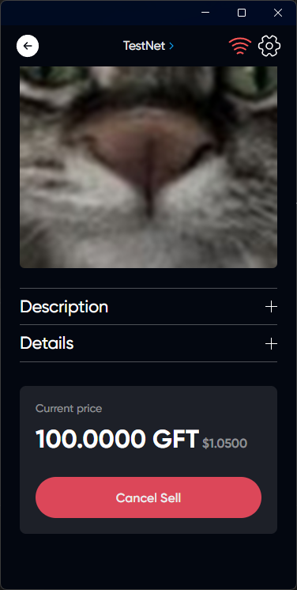

# Sell NFT

## Description



You can sell your NFT on the NFT market.
Consider the creator of NFT can charge a commission for the sale of NFT



## How Sell NFT

### Choose the right NFT on the NFTs tab in the main menu

### Click on the Shopping Cart

### Choose a token in which the purchase will be made and enter the amount of token



After being put up for sale, anyone can purchase this NFT.





Below is the amount that the Creator will receive when selling



### Click on Sell

### Now we can find this NFT on the market

