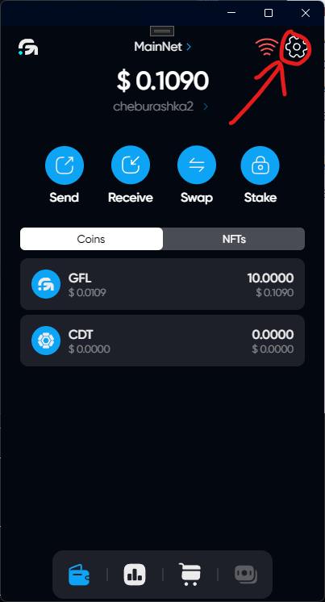
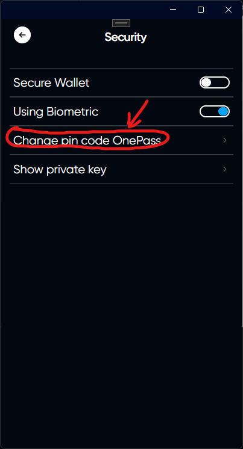
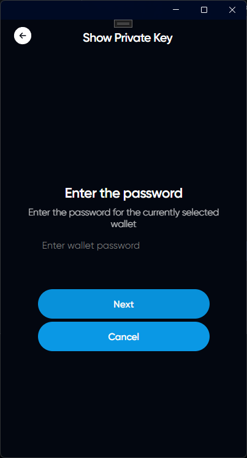

# Сhange pin code OnePass
## Log in to your account and open the settings

## Open the security tab

## Click on Сhange pin code OnePass

## Then follow the instructions provided in the application

